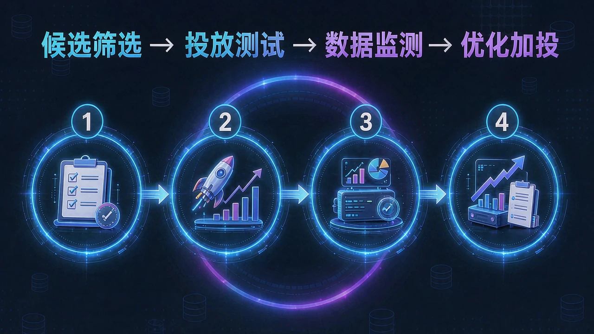
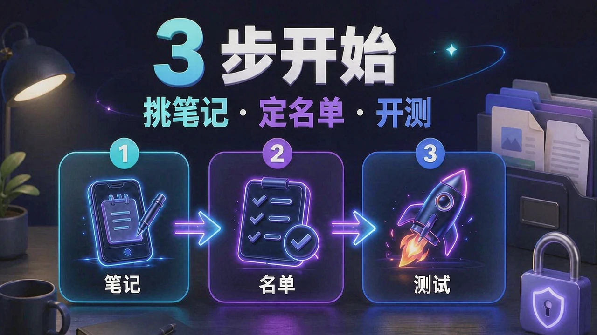

<!-- README-PROMO:START -->
<p align="center">
  
  
  
</p>
<!-- README-PROMO:END -->

# jiare 加热 — 小红书薯条投放运营库

> 目的：为佳康顺小红书账号（佳康顺医疗器械，小红书号 49313135003）做**薯条内容加热**的规划与运营接管。
>
> 建立：2026-09-10 ｜ 目标：店铺成交闭环 ｜ 预算：1500 元启动资金（可追加）

<p align="center">
  
  
  
  
</p>

---

## 目录

| 文件 | 内容 |
|---|---|
| `资料库/01_内部课件提取_薯条与流量机制.md` | 公司课件 OCR 提取 |
| `资料库/02_外部调研_薯条加热玩法与基准.md` | 网络调研 |
| `资料库/03_小红书薯条加热规划方案_v1.md` | 规划总纲（采访前版，战略仍有效） |
| `资料库/04_采访纪要与账户现状_2026-09-10.md` | **采访定稿 + 后台数据解读** |
| `资料库/05_1500元启动资金投放作战方案_v1.md` | **当前执行方案（作战版）** |
| `薯条投放台账_模板.xlsx` | 投放台账 + 判定线参数表 |
| `_raw/pdf_render/` | 课件渲染过程件 |
| 根目录截图 | 后台数据原始截图（2026-09-10） |

---

## 当前状态（2026-09-12）

- ✅ 采访完成（24 问）
- ✅ 后台数据已读取（周曝光 8160 / 点击率 9.8% / 搜索占 40% / 粉丝 55+ 占 54%）
- ✅ 5 项执行确认全部落定（员工有支付权限 / 内容改造 1+2 / 文件夹 SOP + 聊天指令 / 员工挑候选我定名单 / 历史薯条截图已入库）
- ✅ 历史薯条基准：**150 元 ≈ 1.56 万曝光（CPM ≈ 9.6 元）**，1500 元 ≈ 15 万曝光理论盘子
- ⏳ 下一步：员工从笔记管理挑 5 条候选（发布 ≤90 天、视频优先、含关键词、无违规）→ 定首批名单 → 出第一份《当日投放清单》→ A 池 600 元开测

---

## 投放执行框架

```
候选筛选 → 投放测试 → 数据监测 → 优化加投
```

| 环节 | 判定标准 |
|---|---|
| 候选筛选 | 发布 ≤90 天、视频优先、含关键词、无违规 |
| 投放测试 | A 池 600 元开测，分笔记独立追踪 |
| 数据监测 | 曝光 / 点击率 / 互动成本，对照 CPM≈9.6 元基准线 |
| 优化加投 | 跑赢基准线的笔记追加预算，低于判定线停止 |

---

## 关联项目

- [xhs](https://github.com/DaBaoAgent/xhs) — 小红书图文生成技能（内容生产端）
- [xiaohongshu-auto-publisher](https://github.com/DaBaoAgent/xiaohongshu-auto-publisher) — 小红书自动发布工具

---

## License

内部运营项目。
